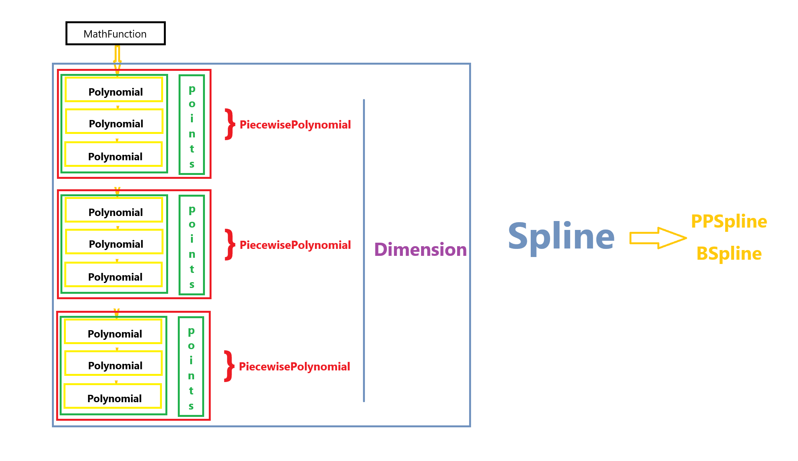

### 样条曲线设计文档

#### 一、程序结构说明

程序主要分为以下模块：

1. **数学函数类 MathFunction**：
   - 定义函数类 `MathFunction`，用于表示数学函数，支持函数值计算。
   
2. **多项式类 Polynomial**：
   - 继承自 `MathFunction`，包括多项式的创建、运算及求导等功能。
    - 各项系数 `coefficients` 
   
3. **分段多项式类 PiecewisePolynomial**：
   - 表示分段多项式,包括分段多项式的创建、运算及求导等功能。
    - 包括*多项式*`polynomials`以及对应的*每个分段的起点*`points`。

4. **样条曲线基类 Spline**：
   - 定义通用的样条曲线接口
    - `dimensions` 表示参数方程中参数的数量。例如二维曲线的参数方程为 \(x(t), y(t)\)，则 `dimensions = 2`， 一维曲线的参数方程为 \(x(t)\)，则 `dimensions = 1`。
    - spline_order 表示样条的次数

5. **PP 样条类 PPSpline**：
   - 继承自 `Spline`，实现分段多项式样条.

6. **B 样条类 BSpline**：
   - 继承自 `Spline`，实现 B 样条的基函数计算和样条生成。

7. **球面样条 SphereSpline**：
   - 用于处理球面上的样条曲线.

8. **辅助函数**：
   - 提供弦长计算、坐标变换、边界条件解析等工具函数。

9. **方程求解器**：
   - 使用 LAPACK 库求解线性方程组。

10. **json 解析器**：
    - 用于读取 JSON 文件，构造样条曲线。

#### 二、设计思路

1. **抽象与继承**：
   - 抽象出通用的 `MathFunction` 类和 `Spline` 基类，具体样条曲线通过继承实现扩展。
   
2. **模块化与复用性**：
   - 每个功能单元独立封装，如多项式运算、分段插值和样条生成，提升模块的复用性。

3. **数值稳定性与效率**：
   - 封装使用 LAPACK 库加速线性代数运算

#### 三、类的功能接口

1. **`MathFunction` 类**
   - `MathFunction(double (*func)(double x))`：通过函数指针初始化函数。
   - `double evaluate(double x)`：计算函数在点 \( x \) 的值。

2. **`Polynomial` 类**
   - 构造多项式：
     - `Polynomial(const std::vector<double>& coef)`：直接使用系数构造。
     - `Polynomial(const std::vector<double>& x_values, const std::vector<double>& y_values)`：通过 Newton 插值构造。
    - 输出公表达式：
     - `void print()`：从低到高输出多项式各项系数。
   - 运算操作：
     - 重载 `+`, `-`, `*` 运算符。
   - 求导与计算：
     - `Polynomial derivative()`：返回导数。
     - `double evaluate(double x)`：计算多项式值。

3. **`PiecewisePolynomial` 类**
   - 构造分段多项式：
     - `PiecewisePolynomial(const std::vector<Polynomial>& p, const std::vector<double>& x)`。
   - 求值与打印：
     - `double evaluate(double x)`：计算分段多项式值。
     - `void print()`：输出分段公式。

4. **`Spline` 类**
   - 提供样条公共接口：
     - `std::vector<double> operator()(double t)`：计算样条在参数 \( t \) 处的值。
     - `void print()`：输出样条公式。

5. **`PPSpline` 类**
   - 提供 PP 样条的多种构造方法接口：
     - 针对给定的函数以及分段的点进行构造
     - 针对给定函数、给定区间、给定分段数进行构造，包括均匀选点和累积弦长法选点
     - 通过读取json文件构造样条
     - 通过给定的散点坐标构造样条
   - 使用统一的函数计算样条段多项式：
     - `PiecewisePolynomial compute_spline_segments()`。

6. **`BSpline` 类**
   - 提供基函数的实现：
     - `double evaluate_basis(int i, int k, double x)`：计算基函数值。
     - `evaluate_basis_derivative(int i, int k, double x)`：计算基函数导数值。
   - 提供B样条的多种构造方法接口：
     - 针对给定的函数以及分段的点进行构造
     - 针对给定函数、给定区间、给定分段数进行构造，包括均匀选点和累积弦长法选点
     - 通过读取json文件构造样条
     - 通过给定的散点坐标构造样条
   - 使用统一的函数计算样条段多项式：
       - `PiecewisePolynomial compute_spline_segments()`。

7. **辅助函数**
   - 提供坐标转换、弦长计算等工具函数。

#### 四、数学原理

1. **Newton 插值公式**：
   \[
   P(x) = f[x_0] + f[x_0, x_1](x-x_0) + \cdots + f[x_0, x_1, \dots, x_n](x-x_0)(x-x_1)\cdots(x-x_{n-1})
   \]

2. **样条方程组**：
   - 对于每段多项式 \( S_i(x) \)，要求满足：
     \[
     S_i(x_j) = y_j, \quad i = 0, \dots, n-1
     \]
   - 满足连续性条件：
     \[
     S_i'(x) = S_{i+1}'(x), \quad S_i''(x) = S_{i+1}''(x), \quad \forall i
     \]

3. **B 样条基函数**：
   - 定义递推关系：
     \[
     B_{i,0}(x) = 
     \begin{cases} 
     1 & \text{if } t_i \leq x < t_{i+1} \\
     0 & \text{otherwise}
     \end{cases}
     \]
     \[
     B_{i,k}(x) = \frac{x-t_i}{t_{i+k}-t_i}B_{i,k-1}(x) + \frac{t_{i+k+1}-x}{t_{i+k+1}-t_{i+1}}B_{i+1,k-1}(x)
     \]

4. **累积弦长公式**：
   \[
   L_i = \sum_{j=1}^i \sqrt{(x_j - x_{j-1})^2 + (y_j - y_{j-1})^2}
   \]
