本次项目作业包含以下问题：

## 1. 在ppForm和BSpline格式下分别实现线性样条函数 \( S^0 \) 

### 1.1 总体介绍
以PP-Form为例，在样条的构造函数中有如下代码:
```cpp
if (spline_order == 1) {
        // 线性样条函数S^0_1
        for(int j = 0; j < num_points - 1; ++j) {
            std::vector<double> x(2), y(2);
            x[0] = t[j]; x[1] = t[j + 1];
            y[0] = f[j]; y[1] = f[j + 1];
            polynomials[j] = Polynomial(x, y);
        }
        return PiecewisePolynomial(polynomials, t);
}
```
只需指定`spline_order`为1，即可构造线性样条。

### 1.2 测试结果
测试代码在`main.cpp`中，如下(为了展示简洁，删除了一些内容)：
```cpp
double f1(double x) {
    return exp(x) - x * x + 1;
}

MathFunction f1_func(f1);
std::vector<MathFunction> f_v = {f1_func};

void check_P1() {
    
    PPSpline ppspline(1, 1, f_v, -1, 1, 40);
    BSpline bspline(1, 1, f_v, -1, 1, 40);
    ppspline.print();
    bspline.print();
    system("python3 plot.py output/check/P1_ppspline.txt");
    system("python3 plot.py output/check/P1_bspline.txt");
    stdout = original_stdout;
}
```
运行`main.cpp`，会对目标函数 \( f(x) = e^x - x^2 + 1 \) 进行线性样条拟合，并输出结果，使用python程序绘制拟合结果，结果如下图。
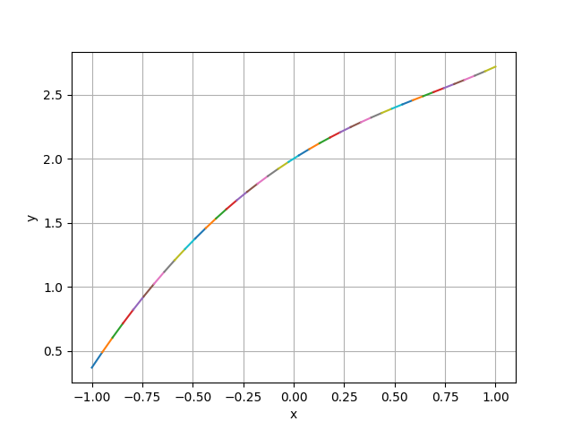


可以看到，两种样条拟合的结果都比较好，至此，实现了第一个需求！


## 2. 在ppForm格式下分别推导并实现三类三次样条函数。

### 2.1 总体介绍

在PPSpline的构造函数中对三类(实际上是五类)边界条件进行了不同的处理。

#### 1. **完全样条（Complete cubic spline）**
   边界条件是：
   \[
   s'(f; a) = f'(a), \quad s'(f; b) = f'(b)
   \]
   方程组形式：
   - 内部节点的方程与图片中的公式一致：
     \[
     \lambda_{i-1} m_{i-1} + 2m_i + \mu_i m_{i+1} = 3[f[x_{i-1}, x_i] + f[x_i, x_{i+1}]]
     \]
     其中 \(i = 2, \dots, N-1\)。
   - 边界条件附加方程：
     \[
     m_1 = f'(a), \quad m_N = f'(b)
     \]

#### 2. **指定二阶导数的三次样条（Cubic spline with specified second derivatives）**
   边界条件是：
   \[
   s''(f; a) = f''(a), \quad s''(f; b) = f''(b)
   \]
   方程组形式：
   - 内部节点的方程与图片中的公式一致：
     \[
     \lambda_{i-1} m_{i-1} + 2m_i + \mu_i m_{i+1} = 3[f[x_{i-1}, x_i] + f[x_i, x_{i+1}]]
     \]
     其中 \(i = 2, \dots, N-1\)。
   - 边界条件附加方程（根据 \(m\) 与二阶导数的关系推导）：
     \[
     m_1 = \frac{6}{x_2 - x_1}(f[x_1, x_2] - f''(a)), \quad m_N = \frac{6}{x_N - x_{N-1}}(f[x_{N-1}, x_N] - f''(b))
     \]

#### 3. **自然样条（Natural cubic spline）**
   边界条件是：
   \[
   s''(f; a) = 0, \quad s''(f; b) = 0
   \]
   方程组形式：
   - 内部节点的方程与图片中的公式一致：
     \[
     \lambda_{i-1} m_{i-1} + 2m_i + \mu_i m_{i+1} = 3[f[x_{i-1}, x_i] + f[x_i, x_{i+1}]]
     \]
     其中 \(i = 2, \dots, N-1\)。
   - 边界条件附加方程（因为二阶导数为零，表示曲率为零）：
     \[
     m_1 = 0, \quad m_N = 0
     \]

#### 4. **无结样条（Not-a-knot cubic spline）**
   边界条件是：
   \[
   s'''(f; x_2) \text{ 连续}, \quad s'''(f; x_{N-1}) \text{ 连续}
   \]
   方程组形式：
   - 内部节点的方程与图片中的公式一致：
     \[
     \lambda_{i-1} m_{i-1} + 2m_i + \mu_i m_{i+1} = 3[f[x_{i-1}, x_i] + f[x_i, x_{i+1}]]
     \]
     其中 \(i = 2, \dots, N-1\)。
   - 边界条件附加方程：
     - 在 \(x_2\) 处：
       \[
       \frac{m_2 - m_1}{x_2 - x_1} = \frac{m_3 - m_2}{x_3 - x_2}
       \]
     - 在 \(x_{N-1}\) 处：
       \[
       \frac{m_{N-1} - m_{N-2}}{x_{N-1} - x_{N-2}} = \frac{m_N - m_{N-1}}{x_N - x_{N-1}}
       \]

#### 5. **周期样条（Periodic cubic spline）**
   边界条件是：
   \[
   s(f; b) = s(f; a), \quad s'(f; b) = s'(f; a), \quad s''(f; b) = s''(f; a)
   \]
   方程组形式：
   - 内部节点的方程与图片中的公式一致：
     \[
     \lambda_{i-1} m_{i-1} + 2m_i + \mu_i m_{i+1} = 3[f[x_{i-1}, x_i] + f[x_i, x_{i+1}]]
     \]
     其中 \(i = 2, \dots, N-1\)。
   - 边界条件附加方程：
     \[
     m_1 = m_N, \quad \frac{m_2 - m_1}{x_2 - x_1} = \frac{m_N - m_{N-1}}{x_N - x_{N-1}}
     \]

具体代码过于冗长，这里不再展示。

### 2.2 测试结果
在`main.cpp`中，对三类三次样条函数进行了测试，选取和上一问相同的函数并选择随机选取结点：
```cpp
void check_P2() {

    // 在 [-1, 1] 上不均匀的随机选取 11 个节点
    std::vector<double> t1;
    for (int i = 1; i <= 11; i++) {
        t1.push_back(-1 + 2.0 * rand() / RAND_MAX);
    }
    std::sort(t1.begin(), t1.end()); // 使用 std::sort 进行排序
    
    FILE* original_stdout = stdout;
    PPSpline spline1(1, 3, f_v, t1, NATURAL_SPLINE);
    spline1.print();

    PPSpline spline2(1, 3, f_v, t1, CLAMPED);
    spline2.print();

    PPSpline spline3(1, 3, f_v, t1, PERIODIC_CONDITION);
    spline3.print();

}
```
运行后，生成三种不同边界条件的三次样条函数，如下图所示：
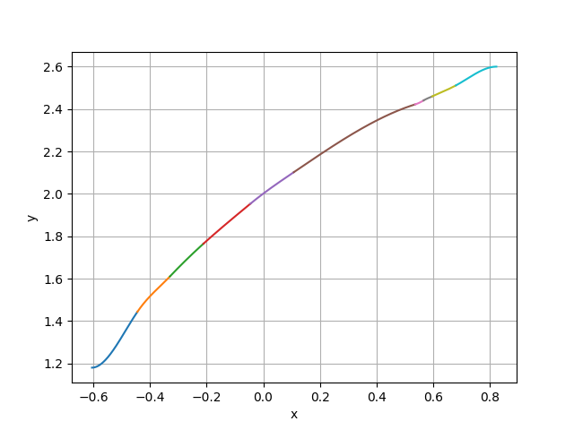
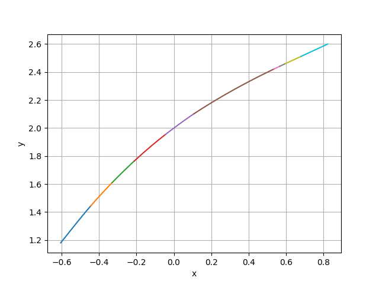


可以看到，三种不同边界条件的三次样条函数都能很好地拟合目标函数，至此，实现了第二个需求！


## 3. 在BSpline格式下分别推导并实现三类三次样条函数。

### 3.1 总体介绍&测试结果

与PPSpline类似，BSpline类中也对三类边界条件进行了不同的处理。这里不再复述，只展示结果。

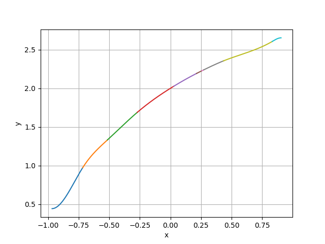
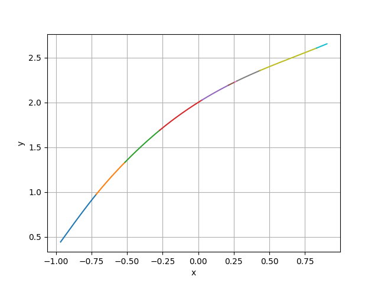


可以看到，三种不同边界条件的三次样条函数都能很好地拟合目标函数,而且和PP样条得到的结果在可接受的误差之内，至此，实现了第三个需求！

## 4. 验证ppForm和BSpline格式下取相同插值点和相同边界条件，得到的曲线是相同的。

### 4.1 总体介绍&测试结果

在`main.cpp`中，通过绘制ProblemE的两个结果进行比较，具体请见后面ProblemE的报告，这里只给出结果。

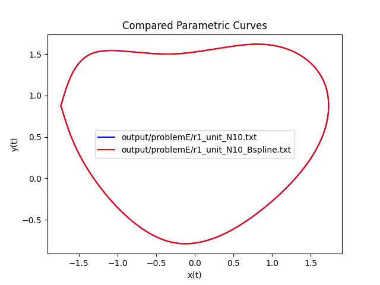

可以看到，两条曲线完全重合，因此得到结论，在可接受的误差内(往往误差来自于浮点误差)，两者得到的结果是一致的，从上一题也可以看出这一点。至此，实现了第四个需求！


## 5. BSpline格式应支持任意阶、任意节点样条的绘制。

### 5.1 总体介绍

为了实现这一功能，在BSpline类中添加了一个新的构造函数以及一个计算各阶基函数系数的函数，如下：
```cpp
std::vector<std::vector<double>> evaluate_basis_coefficients(int i, int k) const;

 BSpline(int dim, int order, const std::vector<double>& coefficients, 
            const std::vector<double>& time_points);
```
前者通过输入i和n，递归的计算在各个分段区间内，基函数的系数数组，从高到低排序。

后者通过前者计算得到的系数数组，以及给定的系数权重和节点，构造一个BSpline对象。

### 5.2 测试结果

在`main.cpp`中，对BSpline类进行了测试，如下：
```cpp
check_P5(){
    //随机生成节点序列N=11
    std::vector<double> t1;
    for (int i = 1; i <= 11; i++) {
        t1.push_back(-0.5 + 2.0 * rand() / RAND_MAX);
    }
    std::sort(t1.begin(), t1.end()); 

    std::vector<double> coefficients;
    for (int i = 1; i <= 14; i++) {
        coefficients.push_back(-1.0 + 2.0 * rand() / RAND_MAX);
    }
    BSpline spline1(1, 4, coefficients, t1);
    spline1.print();
}
```
随机生成系数和节点，构造BSpline对象，如下图所示：

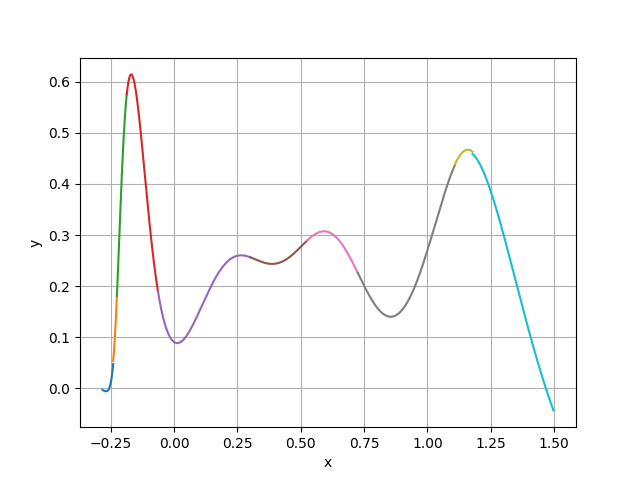

可以看到，拟合的不是很好...


## 6. 实现平面上的样条曲线拟合

### 6.1 总体介绍

从给定的曲线上选取若干个点，使用之前实现的样条拟合方法进行拟合。

下面的题目都是曲线拟合，不再额外测试。

## 7. 实现球面上的样条曲线拟合

### 7.1 总体介绍

首先在空间中以(0,0,1)为球心，1为半径做一个球，连接北极点(0,0,2)与球上一点会与xOy平面有一个交点，因此实现了从球面到平面的一个映射。对球面上的若干个点，我们先将其映射到平面上，然后使用之前实现的样条拟合方法进行拟合，然后再将拟合结果映射回球面。

### 7.2 测试结果

随机选取了球面上的若干点，进行了拟合，如下图所示：
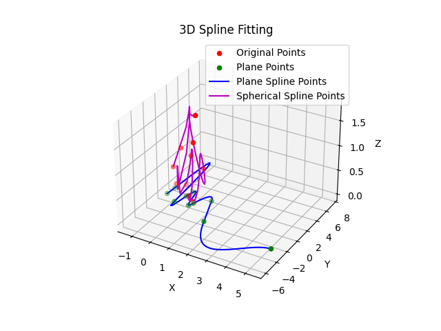
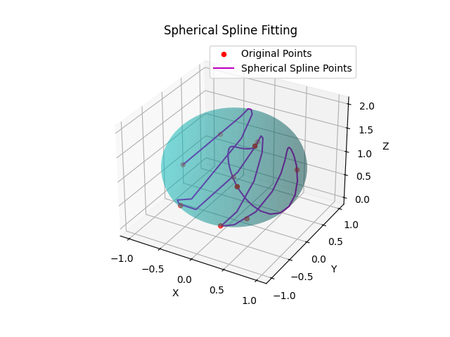

可以看到，拟合效果还是不错的，至此，实现了第七个需求！

## 8. Problem A

### 8.1 测试代码

```cpp
// 定义MathFunction f(x) = 1/(1 + 25 * x^2)
double f(double x) {
    return 1.0 / (1 + 25 * x * x);
}

MathFunction f_func(f);

std::vector<int> Ns = {6, 11, 21, 41, 81} ;

int main () {
    for (int i = 0; i < Ns.size (); ++ i) {
        freopen (("output/problemA/N_" + std :: to_string (Ns [i]) + ".txt").c_str (), "w", stdout);
        std::vector<MathFunction> f_v = {f_func};
        PPSpline spline (1, 3, f_v, -1.0, 1.0, Ns [i], CLAMPED); 
        spline.print ();
        double maxError = 0.0;
        for (int j = 0; j < Ns [i] - 1; ++ j) {
            
            double x = -1.0 + j * 2.0 / (Ns [i] - 1) + 1.0 / (Ns [i] - 1);
            double error = fabs (spline (x)[0] - f (x));
            if (error > maxError)
                maxError = error;
        }
        std :: cerr << "Error (N = " << Ns [i] << "): " << maxError << std :: endl;
        fclose (stdout);
    }
    return 0;
}
```

### 8.2 测试结果

```
Error (N = 6): 0.422378
Error (N = 11): 0.02052
Error (N = 21): 0.00316891
Error (N = 41): 0.000586206
Error (N = 81): 0.000293076
```

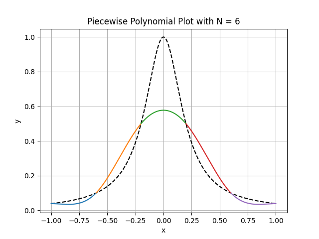
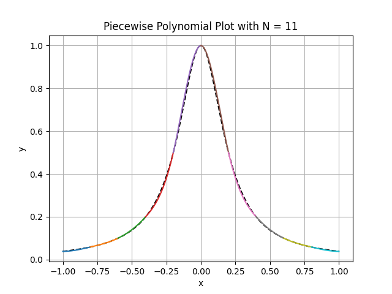
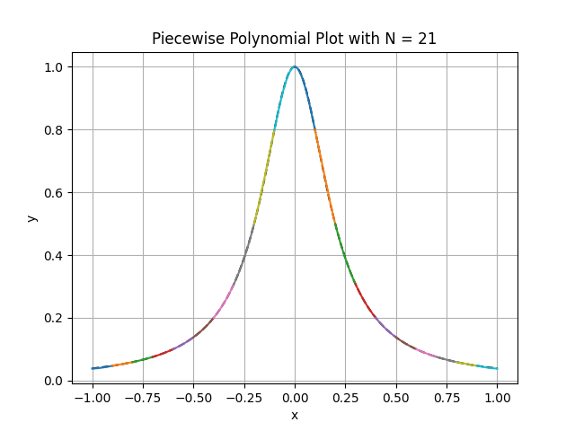
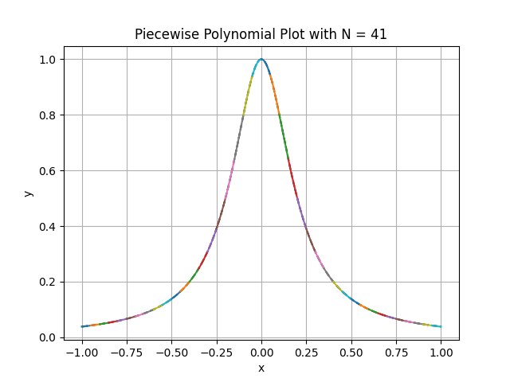
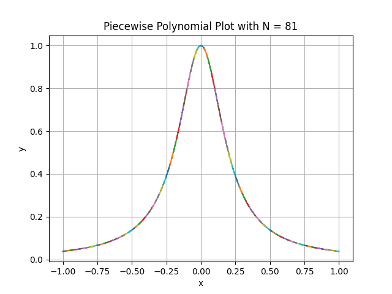

曲线的拟合效果较好。

## 9. Problem C

### 9.1 测试代码

```cpp
double f(double x) {
    return 1 / (1 + x * x);
}

MathFunction f_func(f);

int main() {
    std::vector<MathFunction> f_v = {f_func};
    std::vector<double> t1;
    for (int i = 1; i <= 11; i++) {
        t1.push_back(i - 6);
    }
    freopen("output/problemC/s23.txt", "w", stdout);
    BSpline spline1(1, 3, f_v, t1, NATURAL_SPLINE);
    spline1.print();
    fclose(stdout);

    std::vector<double> t2;
    for (int i = 1; i <= 10; i++) {
        t2.push_back(i - 5.5);
    }
    freopen("output/problemC/s12.txt", "w", stdout);
    BSpline spline2(1, 2, f_v, t2);
    spline2.print();
    fclose(stdout);

    return 0;
}
```

### 9.2 测试结果
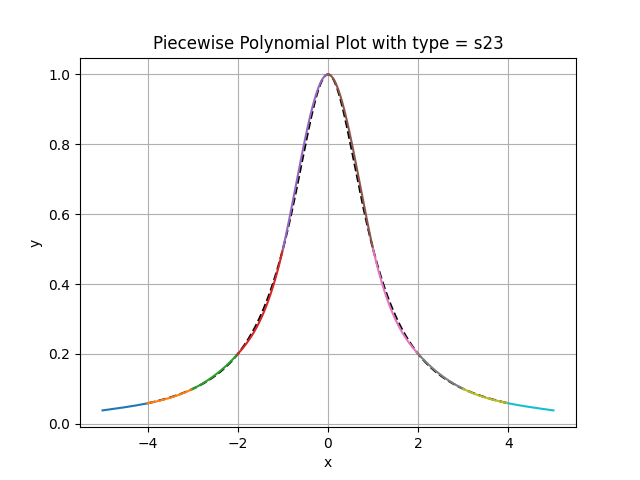
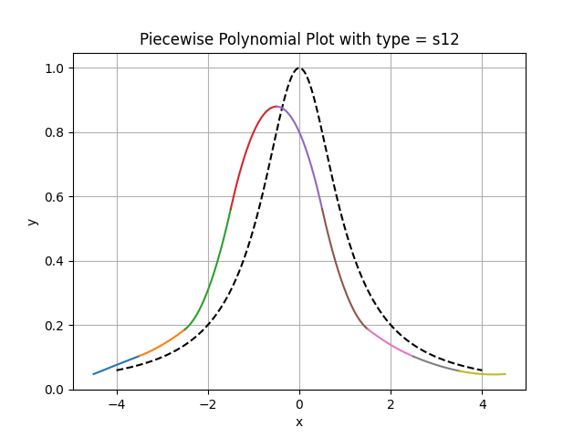


## 10.Problem D

### 10.1 测试代码

```cpp

double f(double x) {
    return 1 / (1 + x * x);
}

MathFunction f_func(f);

int main() {
    std::vector<MathFunction> f_v = {f_func};
    std::vector<double> t1;
    for (int i = 1; i <= 11; i++) {
        t1.push_back(i - 6);
    }
    freopen("output/problemD/s23.txt", "w", stdout);
    BSpline spline1(1, 3, f_v, t1, NATURAL_SPLINE);
    spline1.print();
    fclose(stdout);

    std::vector<double> t2;
    for (int i = 1; i <= 10; i++) {
        t2.push_back(i - 5.5);
    }
    freopen("output/problemD/s12.txt", "w", stdout);
    BSpline spline2(1, 2, f_v, t2);
    spline2.print();
    fclose(stdout);

    std::vector<double> CPS = {-3.5, -3, -0.5, 0, 0.5, 3, 3.5};
    for (int i = 0; i < CPS.size(); ++i) {
        double err1 = fabs(spline1(CPS[i])[0] - f(CPS[i]));
        double err2 = fabs(spline2(CPS[i])[0] - f(CPS[i]));
        std::cerr << "Error at " << CPS[i] << ":\n";
        std::cerr << "Cubic spline: " << err1 << "\n";
        std::cerr << "Quadratic spline: " << err2 << "\n";
    }

    return 0;
}
```


### 10.2 测试结果

```
Error at -3.5:
Cubic spline: 0.000789971
Quadratic spline: 0.027888
Error at -3:
Cubic spline: 8.32667e-17
Quadratic spline: 0.037931
Error at -0.5:
Cubic spline: 0.0205306
Quadratic spline: 0.0797511
Error at 0:
Cubic spline: 1.11022e-16
Quadratic spline: 0.2
Error at 0.5:
Cubic spline: 0.0205306
Quadratic spline: 0.239278
Error at 3:
Cubic spline: 1.94289e-16
Quadratic spline: 0.0245283
Error at 3.5:
Cubic spline: 0.000789971
Quadratic spline: 0.0185731
```

## 11. Problem E

分别实现题目要求的心形曲线\[ r_2(t) = (x(t), y(t)) = (\sin t + t \cos t, \cos t - t \sin t), t \in [0, 6\pi] \]和\[ r_3(t) = (x(t), y(t), z(t)) = (\sin(u(t)) \cos(v(t)), \sin u(t) \sin v(t), \cos u(t)), t \in [0, 2\pi] \]三条曲线的拟合，其中第三条曲线 \( u(t) = \cos t \)，\( v(t) = \sin t \)。三条曲线应使用 cumulative chordal length 和等距节点分别拟合，并比较这两种节点的拟合效果。

### 11.1 测试结果
由于篇幅限制，只展示n=40的拟合结果，其他结果请查看`figure/problemE`文件夹。
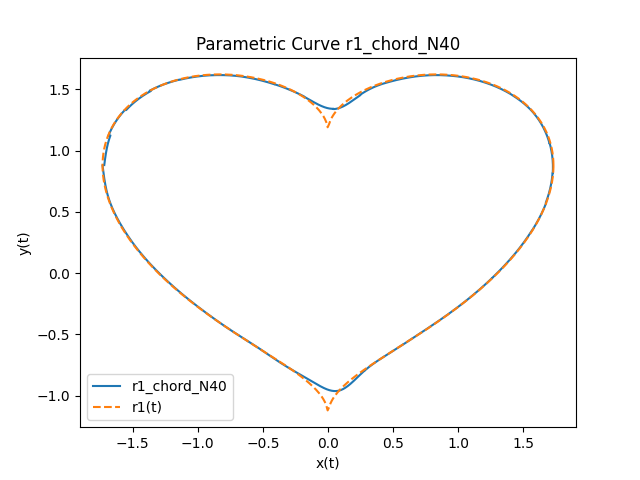
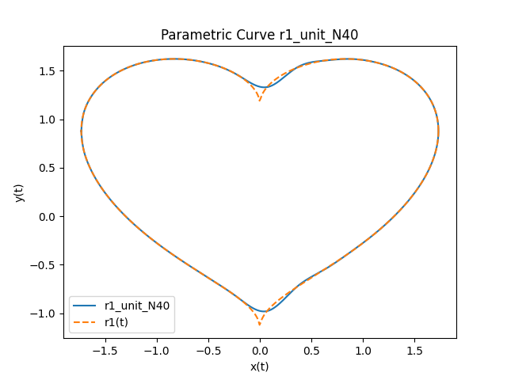
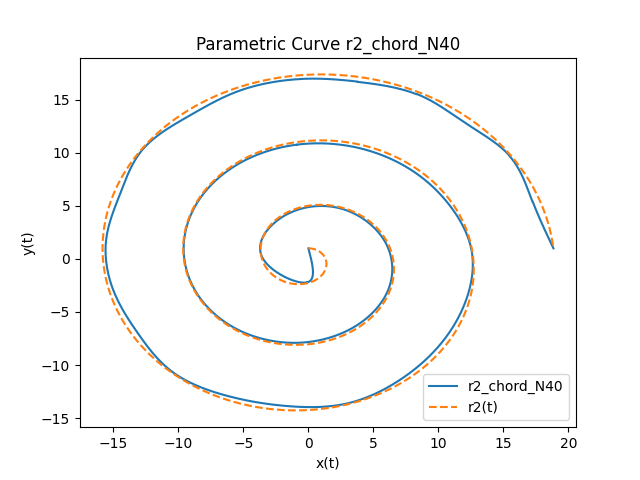
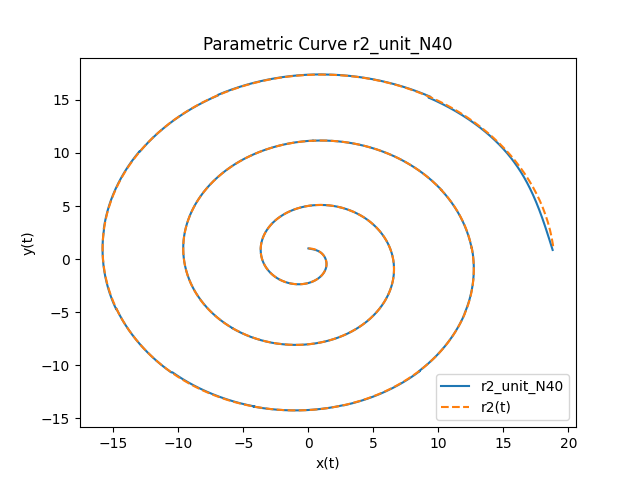
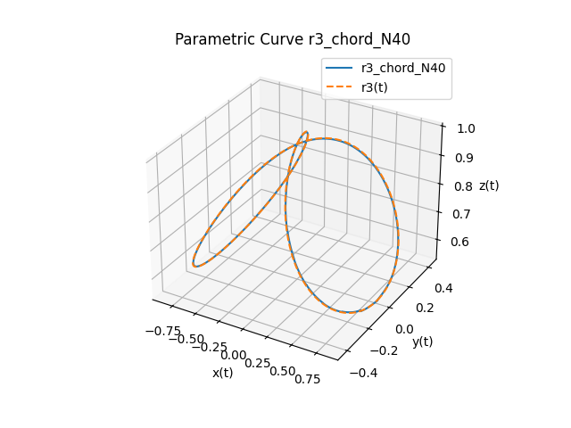
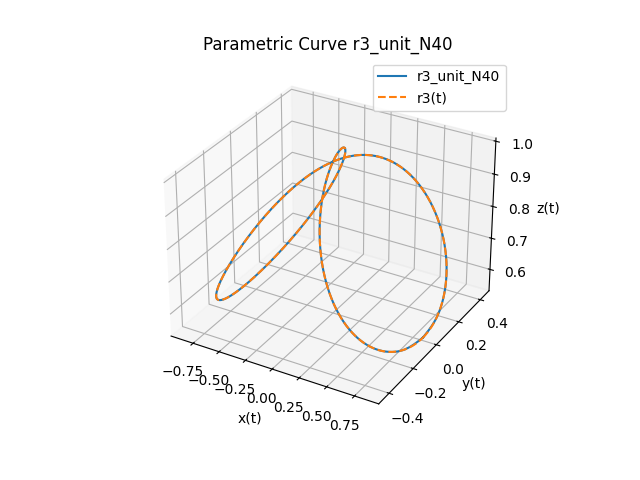
!

## 12. Bonus

### 12.1 jsoncpp的实现

实现了通过json文件控制拟合样条，免去重复编译的问题。

json文件按照以下规则编写：
```json
{
    "spline_type": "BSpline",                       // 样条类型，可以是 "BSpline" 或 "PPSpline"
    "dimension": 2,                                 // 空间维度，需要拟合的变量数量，1 可以表示 y=f(x) 的情况， 2 可以表示  x = x(t), y = y(t) 的情况, 以此类推
    "order": 3,                                     // 阶数k
    "method": "uniform",                            // 选点方式，包括均匀(uniform),累积弦长(chordal),自定义选点(custom)，特殊(special)
    "interval": [-1, 1],                            // 选点方式为“均匀”或者“累积弦长”时填写
    "num_interval":10,                              // 选点方式为“均匀”或者“累积弦长”时填写
    "time_points": [0, 1, 2, 3, 4],                 // 节点序列（选点方式为“自定义”或者“特殊”时填写）
    "coefficients": [1, 2, 3, 4, 5, 6, 7, 8],       // 系数向量（当选点方式为“特殊”时填写）
    "boundary_condition": "NATURAL_SPLINE",         // 边界条件，可以是 "NATURAL_SPLINE", "CLAMPED",  "PERIODIC_CONDITION"
    "da": 0.0,                                      // 边界条件的导数值
    "db": 0.0                                       // 边界条件的导数值
}
```
运行`src/Json/test.cpp`，即可通过json文件控制拟合样条。

### 12.2 更多的函数样例测试

#### 12.2.1 选取了五个函数

一次函数，二次函数，高次函数，指数函数和对数函数，三角函数。

绘图如下：


可以看出，拟合结果都很好。

## 12.3 收敛阶分析

### 12.3.1 三阶B样条(自然边界条件)

在自然边界条件下，逼近函数的二阶导数在两端点处被设定为零，即 \(N''(a) = 0\)，\(N''(b) = 0\)，以保证插值的光滑性。

考虑目标函数 \(f(x)\) 是一个四阶连续可导函数，即 \(f \in C^4\)，并用三阶B样条进行插值或逼近。在节点均匀分布且节点间距为 \(h\) 的情况下，逼近误差可以表示为：

\[
\| f(x) - S(x) \|_\infty = C \cdot h^4 \cdot \max_{x \in [a, b]} |f^{(4)}(x)| + \mathcal{O}(h^5)
\]

其中，\(\| \cdot \|_\infty\) 表示最大范数，\(C\) 是与样条基函数有关的常数，\(h\) 为节点间距。这个结果表明，三阶B样条的全局误差收敛速率是四阶的。

误差 \(f(x) - S(x)\) 可以分解为两部分：目标函数与插值函数之间的误差 \(f(x) - I[f](x)\)，以及插值函数与B样条函数之间的误差 \(I[f](x) - S(x)\)。第一部分的误差来源于插值多项式的构造，其收敛阶为四；第二部分由于B样条基函数的光滑性和节点分布的合理性，其阶数影响可以忽略。因此，整体误差的收敛阶仍由第一部分主导，保持为四。

### 12.3.2 三阶PP样条(自然边界条件)

在每个子区间 \([x_i, x_{i+1}]\) 内，三阶PP样条 \(S(x)\) 是一个三次多项式。令 \(x \in [x_i, x_{i+1}]\)，样条的表示形式为：
\[
S(x) = a_i + b_i(x-x_i) + c_i(x-x_i)^2 + d_i(x-x_i)^3,
\]
其中 \(a_i, b_i, c_i, d_i\) 是在每个区间上由样条插值条件和自然边界条件唯一确定的系数。由于 \(S(x)\) 在所有区间上满足分段 \(C^2\) 连续性，其一阶导数 \(S'(x)\) 和二阶导数 \(S''(x)\) 在节点处连续，而自然边界条件 \(S''(a) = 0\) 和 \(S''(b) = 0\) 提供了额外的约束。

考虑函数 \(f(x)\) 在节点 \([x_i, x_{i+1}]\) 内的表达式：
\[
f(x) = f(x_i) + f'(x_i)(x-x_i) + \frac{f''(x_i)}{2}(x-x_i)^2 + \frac{f^{(3)}(x_i)}{6}(x-x_i)^3 + R_4(x),
\]
其中 \(R_4(x)\) 是泰勒展开的高阶余项，其形式为：
\[
R_4(x) = \frac{f^{(4)}(\xi)}{24}(x-x_i)^4, \quad \xi \in [x_i, x_{i+1}].
\]

三阶样条 \(S(x)\) 的插值构造保证 \(S(x_i) = f(x_i)\)，且在节点处一阶导数和二阶导数近似于函数 \(f(x)\) 的对应值。误差 \(E(x) = f(x) - S(x)\) 的主导项来源于 \(f(x)\) 和 \(S(x)\) 的三次导数不匹配。通过更高阶的分析，误差在每个子区间内的估计为：
\[
E(x) = \frac{f^{(4)}(\xi)}{384}h^4 + O(h^5), \quad \xi \in [x_i, x_{i+1}].
\]

这里，误差的主要项与函数的四阶导数 \(f^{(4)}(\xi)\) 和节点间距 \(h\) 的四次方成正比。

为了计算整个区间上的全局误差，考虑 \(E(x)\) 在区间上的最大值。由于节点是均匀分布的，积分误差可以用分段误差的叠加近似，总体误差为：
\[
\|E(x)\|_\infty = \max_{x \in [a, b]} |E(x)| \leq C \cdot h^4 \cdot \|f^{(4)}(x)\|_\infty,
\]
其中 \(C\) 是与样条构造有关的常数，\(\|f^{(4)}(x)\|_\infty = \max_{x \in [a, b]} |f^{(4)}(x)|\)。因此，三阶PP样条在自然边界条件下的收敛阶为 \(O(h^4)\)。


